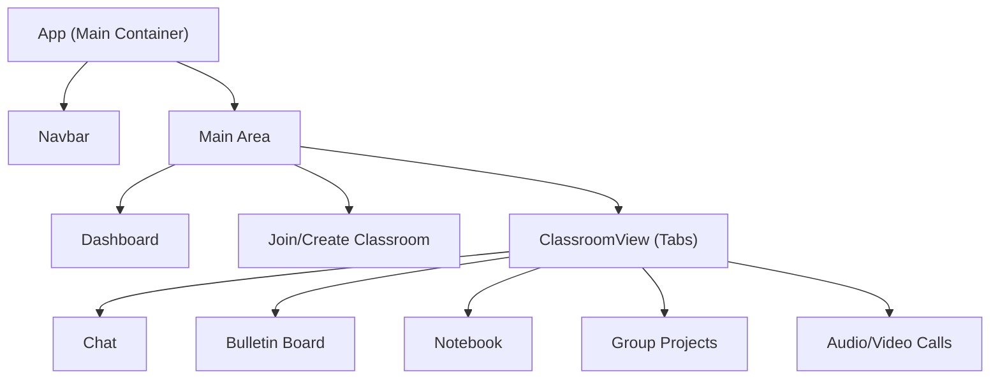

# Classroom Connect – Technical Architecture Overview

## Overview

Classroom Connect is designed as a student-friendly, web-based collaboration platform, using React (JavaScript) with modular, component-driven UI architecture. The application aims for a playful, modern look, leveraging a custom color palette and minimal dependencies. This documentation outlines the initial technical architecture, container/component structure, state and prop flows, navigation logic, and theming setup according to the current codebase and implementation strategy.

---

## Containers and Component Structure

### Top-Level Container

- **`App` (Main Application Container):**
  - **Location:** `classroom_connect/src/App.js`
  - **Responsibility:** Hosts the central layout, manages high-level navigation (dashboard vs. classroom views), and provides persistent UI structures like navigation bars.
  - **Composition:**
    - **Navbar/Navigation Bar:** Fixed to the top, always present.
    - **Main Content Area:** Switches between the landing/dashboard and classroom subviews (in current code, a placeholder “hero” section).
    - [Planned] Container logic will route between:
      - Dashboard/Home (listing classrooms joined)
      - Classroom space (exposing features: Chat, Bulletin, Notebook, Groups, Calls)

### Planned Feature Components (to be scaffolded within the main container)

Each feature is intended to be its own React component, enabling:
- Isolated state-management scoped per feature
- Future scalability (feature toggling, async data, or backend integration)

Main subcomponents:
- **Dashboard:** Shows cards for each classroom.
- **Join/Create Classroom:** Entry code dialog, creation form, persistent local/session storage for user ID and joined classrooms.
- **ClassroomView:** Root for in-classroom tabs, with “Chat”, “Bulletin Board”, “Notebook”, “Group Projects”, and “Calls” as tabbed/sectioned children.
- **Common Components:** Buttons (`.btn`), containers (`.container`), navigational headers, and future input controls.

Component Structure Diagram (high-level, Mermaid):



---

## State & Prop Flow

- **Current Implementation:** Minimal, as state handling is yet to be added in main container (`App`) and feature components are not yet present.
- **Planned Approach:**
  - Top-level state will live in `App` for navigation, with context and/or prop-drilling for user/session data.
  - Feature-specific state (messages, notes, tasks, calls) scoped to individual components. Where features need to interact (e.g., user session info), shared context or prop-passing is intended.
  - Persistent device/session ID and joined classrooms list will be stored using `localStorage` or `sessionStorage` at the App or Dashboard level.

---

## Navigation Routing

- **Current Approach:** Manual UI switching (single view).
- **Planned:** Simple client-side routing (if multi-view required), using either conditional rendering or a lightweight route-management tool if needed—currently out-of-scope for existing code.
- **Navigation Bar (`.navbar`):** Always visible, provides app branding and future navigation links.
- **Section Switching:** Inside classroom, switch/tab between feature panels (Chat, Bulletin, etc.).

---

## Theming and Styles

- **Location:** `classroom_connect/src/App.css`
- **Mechanism:** CSS custom properties (`:root { ... }`) define theme variables and main color palette.
  - **Primary Colors:**
    - `--kavia-orange: #E87A41` (brand accent)
    - `--kavia-dark: #1A1A1A` (background)
    - `--text-color: #ffffff`
    - `--text-secondary: rgba(255, 255, 255, 0.7)`
    - `--border-color: rgba(255, 255, 255, 0.1)`
- **Usage:**
  - Navbar, buttons, and interactive UI elements reference these variables for consistent theming.
  - Most styles leverage BEM-like utility classes (`.btn`, `.container`, `.navbar`, `.title`, etc.) defined in `App.css` for a lightweight, framework-free style approach.
- **Planned:** Additional color variables and playful elements may be introduced as features are built out.

---

## File Reference

| File                                               | Purpose                                   |
|----------------------------------------------------|-------------------------------------------|
| `src/App.js`                                       | Main React container, sets up UI skeleton |
| `src/App.css`                                      | Theme, core UI styles, and color palette  |
| `src/index.js`                                     | App entrypoint/bootstrap                  |

---

## Summary

The technical foundation for Classroom Connect is set for modular feature development, minimalist dependency usage, and strong visual theming. As features are scaffolded, this document should be updated to reflect additional components, navigation logic, and any state management evolutions.

```
Created with reference to:
- `classroom_connect/src/App.js`
- `classroom_connect/src/index.js`
- `classroom_connect/src/App.css`
```
